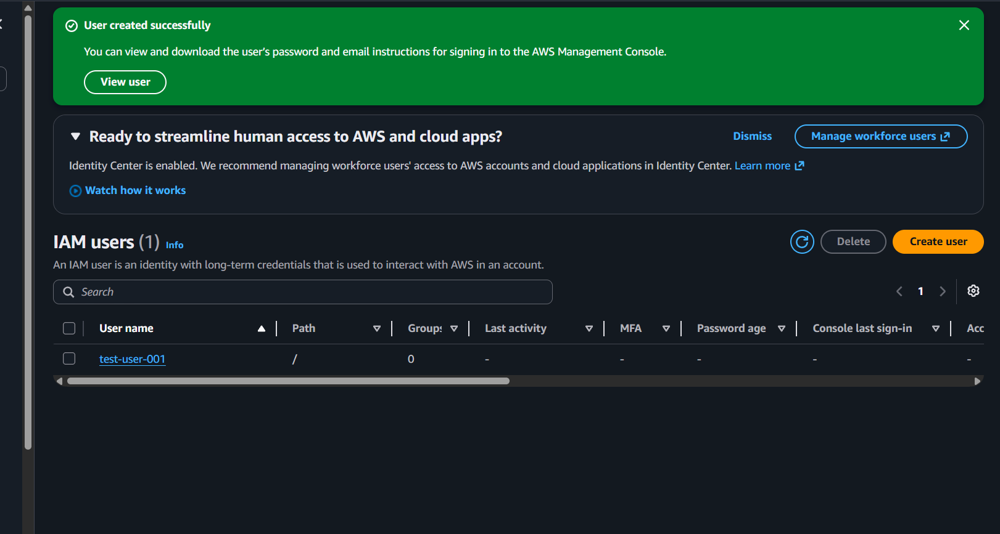
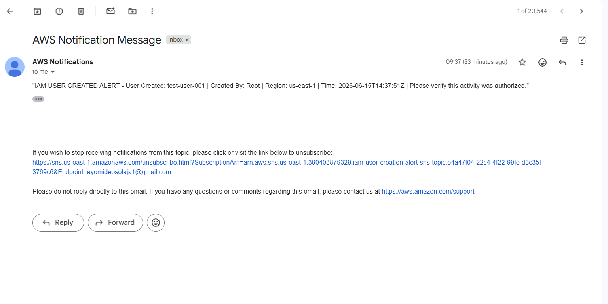

# AWS IAM User Creation Alert System

## Overview

This project detects IAM user creation events in AWS and sends email alerts to security administrators.

## Architecture

IAM User Creation
        |
        v
   CloudTrail
        |
        v
   EventBridge
        |
        v
      SNS
        |
        v
   Email Alert

## Technologies

- AWS IAM
- AWS CloudTrail
- AWS EventBridge
- AWS SNS
- Terraform

## Features

- Detects IAM user creation
- Sends automated email notifications
- Infrastructure deployed with Terraform
- Multi-region CloudTrail enabled

## Deployment

terraform init

terraform plan

terraform apply

## Screenshots

### IAM User Creation

### Email Alert Notification

## Validation

1. Create a test IAM user
2. Verify EventBridge captures the event
3. Confirm SNS sends email notification

## Cleanup

terraform destroy